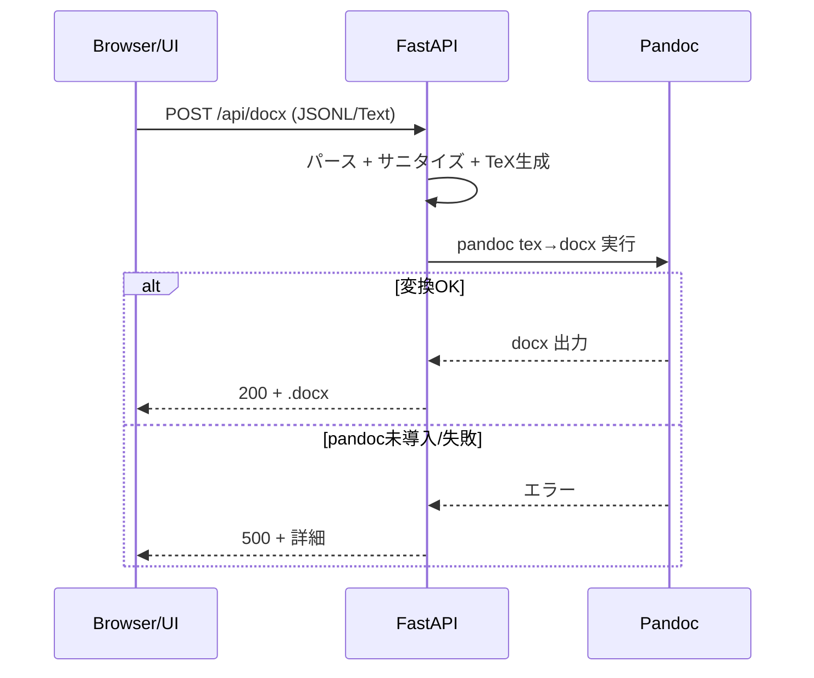

# EquationShot ハンズオン（初心者向け・完全ガイド）

この資料は、はじめての方でも 10〜15 分で「LaTeX → Word ネイティブ数式（OMML）の .docx」を自分のPCで生成できるように、最短の手順を丁寧に案内します。コピペできるコマンドを用意しているので、そのまま進めてください。

---

## 0. 今日つくるもの（ゴール）
- ブラウザでテキストを貼り付け → 「.docx を生成」
- 出力: Word の「ネイティブ数式（OMML）」が番号付きで並ぶ `equations.docx`
- 入力は3パターンに対応
  - JSONL（おすすめ）: 1行 = 1式のJSON
  - JSON配列: `[ {...}, {...} ]` 形式
  - Text: LaTeX本体を1行 = 1式

---

## 1. 事前チェック（1分）
- Python 3.10 以上が入っているか
  - mac/Linux: `python3 --version`
  - Windows: PowerShellで `py -3 --version`
- インターネット接続（初回の依存インストールと自動ダウンロードに必要）

OKなら次へ進みましょう。

### 1.1 Python が未導入なら（3〜5分）
以下のいずれかの方法で Python 3.10 以上を入れてください。

- macOS（どちらか便利な方で）
  - 公式インストーラ（推奨・簡単）
    1) ダウンロード: https://www.python.org/downloads/macos/
    2) 最新の macOS 用 `.pkg` を実行（画面の指示に従って進める）
    3) 新しいTerminalを開いて確認: `python3 --version`
  - Homebrew を使う場合
    ```bash
    brew install python
    python3 --version
    ```

- Windows 10/11（公式インストーラ）
  1) ダウンロード: https://www.python.org/downloads/windows/
  2) インストーラ起動 →「Add python.exe to PATH」にチェック → インストール
  3) PowerShellで確認:
     ```powershell
     py -3 --version
     python --version
     ```

- Linux（例: Ubuntu/Debian）
  ```bash
  sudo apt-get update && sudo apt-get install -y python3 python3-venv python3-pip
  python3 --version
  ```

補足（pipが見つからない時）
```bash
python3 -m ensurepip --upgrade
python3 -m pip --version
```

---

## 2. セットアップ（3〜5分）
まず、プロジェクトフォルダ（このファイルがある場所）に移動します。続けて下の3行をそのまま実行します。

macOS / Linux（Terminal）
```bash
cd /path/to/EquationShot  # 例: cd ~/Documents/EquationShot
python3 -m venv .venv && source .venv/bin/activate
python -m pip install -r requirements.txt
python -m app.main
```

Windows（PowerShell）
```powershell
cd C:\\path\\to\\EquationShot  # 例: cd $HOME\Documents\EquationShot
py -3 -m venv .venv; .\\.venv\Scripts\Activate.ps1
python -m pip install -r requirements.txt
python -m app.main
```

起動に成功すると、コンソールに次のように表示されます。
```
Uvicorn running on http://127.0.0.1:8000
Application startup complete.
```

---

---

## 3. 動作確認（1分）
- ブラウザで `http://127.0.0.1:8000/` を開く
- 別ウィンドウで確認したい場合はヘルスチェック
  - mac/Linux: `curl http://127.0.0.1:8000/healthz`
  - Windows: `Invoke-WebRequest http://127.0.0.1:8000/healthz`
  - どちらも `{"status":"ok"}` が返ればOK

---

## 4. はじめての生成（2分）
画面のモードで「JSONL」を選び、下の2行を丸ごと貼り付けて「.docx を生成」をクリック。

JSONL（サンプル）
```
{"id":"jac","latex":"\\operatorname{Jaccard}(A,B)=\\frac{\\lvert A\\cap B\\rvert}{\\lvert A\\cup B\\rvert}","caption":"Jaccard similarity","inline":false}
{"id":"bayes","latex":"P(A\\mid B)=\\frac{P(B\\mid A)P(A)}{P(B)}","caption":"Bayes' theorem","inline":false}
```
→ `equations.docx` がダウンロードされます（ダブルクリックでWordが開きます）。

ヒント
- JSON配列でもOKです（同じ内容を配列で）
```
[{"id":"jac","latex":"\\operatorname{Jaccard}(A,B)=\\frac{\\lvert A\\cap B\\rvert}{\\lvert A\\cup B\\rvert}","inline":false},{"id":"bayes","latex":"P(A\\mid B)=\\frac{P(B\\mid A)P(A)}{P(B)}","inline":false}]
```
- Text モード（LaTeX本体のみ）でもOK
```
\operatorname{softmax}(z_i)=\frac{e^{z_i}}{\sum_j e^{z_j}}
\mathbf{v}=\begin{pmatrix}a\\ b\\ c\end{pmatrix}
```

---

## 5. 大量バッチを回す（3分）
- ChatGPT等で画像から数式を抽出 → JSONL（1行=1式）で保存
- 数十〜数百式でも、貼り付けてワンクリックで `.docx` を一括生成できます（PC性能に依存）
- IDが欠けていても自動連番（`eq001`…）、重複は `a,b,...` で解消します

おすすめの出力形式（JSONL）
- 各行が独立したJSON
- 行末のカンマ不要 / 先頭末尾の `[]` は不要

---

## 6. ChatGPTへの指示テンプレ（コピペ用）
単発（LaTeX 本体のみ）
```
あなたは数式抽出アシスタントです。添付画像内の主たる数式を、Wordで崩れにくいLaTeXで返してください。
- 余計な説明なし、コードブロック1つ（```latex ...```）
- 本体のみ（$ や \[ \] は付けない）
- \dfrac→\frac、\left \right は最小化、演算子は \operatorname{}、行列は pmatrix
```

バッチ（JSONL：1行=1式）
```
画像（複数）の数式を抽出し、1式=1行のJSONで出力してください（JSONL）。
各オブジェクトは次のキーを含む：
- "id": 文字列（未指定なら "eq001" から連番）
- "latex": $や\[ \]を含まない本体のみ
- "caption": 短い説明（任意）
- "inline": true/false（省略時は false）

出力は JSONL のみ。例：
{"id":"jac","latex":"\\operatorname{Jaccard}(A,B)=\\frac{\\lvert A\\cap B\\rvert}{\\lvert A\\cup B\\rvert}","caption":"Jaccard similarity","inline":false}
{"id":"bayes","latex":"P(A\\mid B)=\\frac{P(B\\mid A)P(A)}{P(B)}","caption":"Bayes' theorem","inline":false}
```

---

## 7. よくあるエラーと対処（3分で解決）
- 画面が開けない / 接続拒否
  - サーバが起動しているか確認（コンソールに `Uvicorn running on http://127.0.0.1:8000`）
  - ポート競合時: 起動コマンドを `uvicorn app.main:app --reload --port 8889` に変更 → URL も `:8889` に
- 500: `pandoc not found`
  - 初回は自動ダウンロードを試みます（pypandoc）。失敗時は手動導入
    - macOS: 公式 .pkg（https://github.com/jgm/pandoc/releases）
    - Windows: 公式 .msi / .exe
    - Linux: `sudo apt-get install pandoc`
- 422: JSONL parse error
  - JSONLは「1行=1オブジェクト」。配列で貼るなら `[` `]` 付きでOK（本アプリは両対応）
  - 各行が完全なJSONか（ダブルクォート/カンマ）を確認
- 400: Unbalanced brackets / Contains banned TeX command
  - LaTeXの括弧 `()[]{}` の対応を確認、危険コマンド（\input, \write 等）を除去

---

## 8. 次の一歩（任意）
- 数式のキャプションを充実 → `.docx` で見返しやすく
- 数式IDの命名ルール（ex. chap1_eq_001）で検索性UP
- 共有用に `USAGE_EquationShot.md` と本ハンズオンを同梱

---

## 9. 片付け（任意）
- 実行を止める: ターミナルで `Ctrl + C`
- 仮想環境を終了: `deactivate`
- 一時ファイル: `.equationshot_tmp/` は不要なら削除可

---

## 10. しくみと理論（理系向けの丁寧解説）

> 目的: 「なぜこの手順で Word ネイティブ数式（OMML）が得られるのか」を中身から理解する。

### 10.1 全体パイプライン（1枚図）
```
[入力] JSONL / JSON配列 / LaTeX行
   ↓ パース（JSONL行 or JSON配列 → オブジェクト列）
   ↓ サニタイズ（$や\[\]除去, \dfrac→\frac, \left/\right簡略, かっこ整合, 危険コマンド遮断）
   ↓ TeXドキュメント生成（section* + equation + label + caption / inline段落）
   ↓ Pandoc 変換（LaTeX → .docx 内部の OMML 数式に変換）
[出力] equations.docx（Wordネイティブ数式, 番号付き/見出し/キャプション）
```

Mermaid（対応ビューアで可視化）
```mermaid
flowchart TD
  A[入力: JSONL / JSON配列 / LaTeX行] --> B[パース: JSON→オブジェクト列]
  B --> C[サニタイズ: $/\[\]除去, \dfrac→\frac, 最小化, 危険コマンド遮断, かっこ整合]
  C --> D[TeX生成: section*/equation/inline + caption]
  D --> E[Pandoc変換: LaTeX→docx(OMML)]
  E --> F[出力: equations.docx]
```

### 10.2 データモデル（JSONL）
- フィールド: `id: str`, `latex: str`, `caption?: str`, `inline?: bool=false`
- ID欠落: `eq001` から自動連番。重複すると `a,b,...` のサフィックスで解決。
- `inline=false`: 式番号つき（display）。`true`: 段落内に埋め込み（番号なし）。
- JSON配列でも JSONL でも可（内部で同じ中間表現に正規化）。

### 10.3 サニタイズ規則（崩れない LaTeX へ）
- 包装を除去: `$ ... $`, `\[ ... \]` は外す（本体のみで扱う）。
- 置換: `\dfrac → \frac`（Word 変換での互換性向上）。
- 簡略化: `\left ... \right` は基本削除（必要最小限）。
- 危険コマンド拒否: `\\(write|input|include|openout|read|file|loop|repeat|csname|immediate)` などの I/O・制御系。
- 構文チェック: `{}`, `()`, `[]` のかっこ対応を線形に検査（不一致なら 400）。

例（良い）
```
\operatorname{Jaccard}(A,B)=\frac{\lvert A\cap B\rvert}{\lvert A\cup B\rvert}
```
例（避ける）
```
\dfrac{...}{...}   # → \frac を推奨
\left( ... \right) # Word変換で過剰な伸縮が起きることがある
```

### 10.4 TeX テンプレート（AMS 環境）
- 各式は `\section*{<id>}` の直下に配置。
- display: `\begin{equation}\label{<id>} ... \end{equation}`（自動番号付与）。
- inline: 段落内に `$...$` を挿入（番号なし）。
- キャプション: `\par\small\textit{<caption>}` を式の直後に出力。
- 前提パッケージ: `amsmath, amssymb`。Word変換で安定。

### 10.5 番号付けと OMML への写像
- LaTeX の `equation` 環境 → Pandoc → Word の OMML へ自動変換され、式番号は Word 側で連番化。
- `\label{<id>}` は将来的な相互参照に備えた埋め込み（現行は見出しと整合）。
- inline は OMML のインライン数式ノードとして挿入（番号なし）。

### 10.6 Pandoc 変換の理屈（高レベル）
- Pandoc は LaTeX を中間表現（AST）に解析 → docx Writer が OMML 数式を生成。
- 一部のパッケージ/環境は変換が弱い場合あり → `amsmath` の基本機能内で記述を推奨。
- フォールバック: pandoc が未検出なら pypandoc により自動取得を試みる。

### 10.7 エラーモデル（HTTP）
- 422 Unprocessable Content: JSONL/配列のパース失敗（どの行か/どの配列かを返す）。
- 400 Bad Request: かっこ不一致や危険コマンドなど入力不正（行番号つき）。
- 500 Internal Server Error: pandoc 実行失敗や未導入（stderr 要約を返す）。

シーケンス図（エラーハンドリングの流れ）


### 10.8 性能とスケール感
- 時間計算量は O(N)（N = 式数）。I/O と pandoc の変換コストが支配的。
- 目安: 数十式なら数十秒〜1分程度（マシン差あり）。
- 最適化の余地: 進捗通知（SSE）や並列バッチ、テンポラリ I/O の最小化など（将来拡張）。

### 10.9 記法のベストプラクティス
- 関数名: `\operatorname{name}` を使う（例: `\operatorname{Var}`）。
- ベクトル/行列: 太字 `\mathbf{x}`, 行列は `pmatrix`。
- 条件付き確率: `P(A\mid B)`（`\mid` を用いる）。
- 省略/読みやすさ: `\dfrac` より `\frac`、`\left/\right` は最小化。

### 10.10 既知の崩れと対処
- `aligned` の非常に長い行: Word 側で折返し崩れが起きやすい → 分割（2式に）や `split` を検討。
- 巨大行列: `bmatrix`/`pmatrix` を段に分ける、もしくは図として扱う検討。

### 10.11 セキュリティの考慮
- LaTeX の外部ファイル参照/書き込み等は遮断（正規表現でブロック）。
- 受理前に軽量な構文検査を行い、実行系に渡す前に弾く。

> 補足: 数式は「同じ入力 → 同じ .docx」を作る決定的処理。再現可能な結果が得られます。
---

## 付録 A. つまずいたときの確認リスト（チェック式）
- [ ] `python -m app.main` を実行中（止めていない）
- [ ] ブラウザURLは `http://127.0.0.1:8000/`（ポート付き）
- [ ] JSONLは1行=1式、またはJSON配列で貼っている
- [ ] LaTeXの `$`, `\[`, `\]` は不要（入っていても自動除去されます）
- [ ] `pandoc --version` で導入済み、または自動DLが許可されている

---

## 付録 B. コマンド早見表
起動（macOS/Linux）
```bash
python3 -m venv .venv && source .venv/bin/activate
python -m pip install -r requirements.txt
python -m app.main
```

起動（Windows/PowerShell）
```powershell
py -3 -m venv .venv; .\.venv\Scripts\Activate.ps1
python -m pip install -r requirements.txt
python -m app.main
```

APIで直に `.docx` を受け取る（JSONL）
```bash
curl -X POST \
     -H "Content-Type: application/json" \
     --data '{"jsonl":"{\"id\":\"t1\",\"latex\":\"a^2+b^2=c^2\",\"inline\":false}\\n{\"id\":\"t2\",\"latex\":\"P(A\\\\mid B)=...\",\"inline\":false}"}' \
     --output equations.docx \
     http://127.0.0.1:8000/api/docx
```

---

困ったら、このハンズオンの該当セクションに戻って確認してください。以上で準備完了です！

---

## 付録 C. ディレクトリ構造（全体像）
配布されたフォルダは以下の構成です。場所を見失ったらこの図で確認します。

```
EquationShot/
├─ app/
│  ├─ __init__.py               # Pythonパッケージ化用
│  ├─ main.py                   # サーバの入り口(UI+API)
│  └─ texgen.py                 # TeX文書組み立て/サニタイズ
├─ requirements.txt             # 必要ライブラリ
├─ HANDS_ON_EquationShot_JP.md  # このハンズオン
├─ PROMPTS_EquationShot_JP.md  # プロンプトテンプレート
```

---